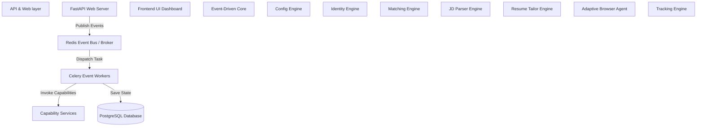
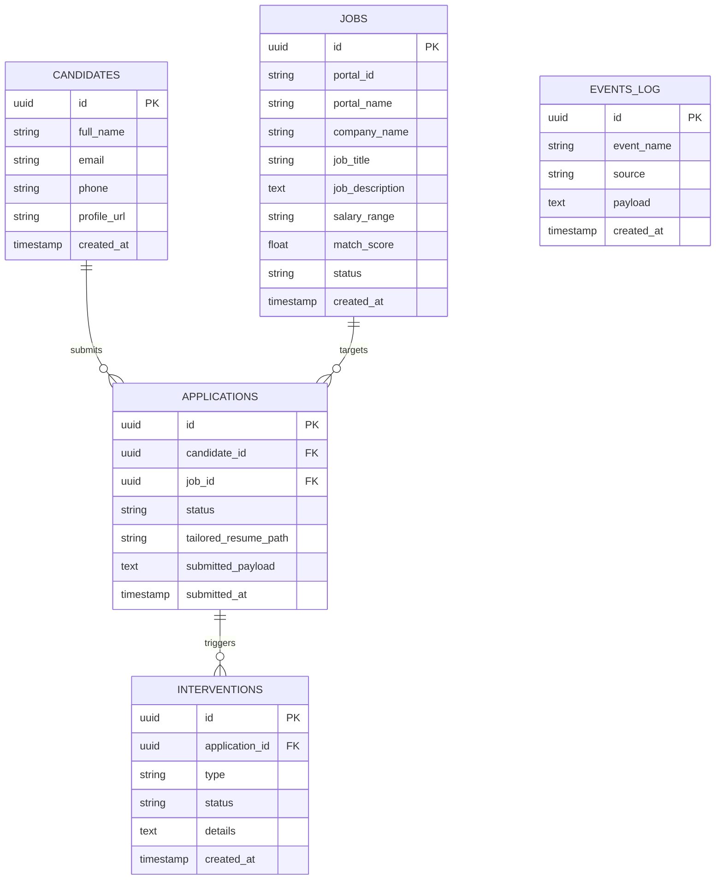

# JobPilot AI
## Autonomous Multi-Agent Recruitment Platform

Version: 1.0

---

# Vision

JobPilot AI is an autonomous multi-agent recruitment platform designed to eliminate repetitive job application tasks while maximizing interview opportunities.

The system intelligently discovers jobs, analyzes job descriptions, measures compatibility against the user's professional profile, tailors resumes and cover letters, completes applications across multiple ATS platforms, tracks every submission, learns from previous outcomes, and continuously improves future applications.

The platform combines deterministic automation with selective AI reasoning to minimize operational cost while maintaining high-quality applications.

---

# Mission

Reduce manual job application effort by more than 95% while increasing interview conversion through intelligent resume tailoring and automated application workflows.

---

# Primary Objectives

• Automatically discover relevant DevOps, Cloud, Platform Engineering, SRE, and Infrastructure jobs.
• Analyze every Job Description.
• Calculate an intelligent Job Match Score.
• Identify missing skills.
• Tailor resumes automatically.
• Generate customized cover letters.
• Complete applications automatically.
• Handle multiple ATS platforms.
• Maintain complete application history.
• Learn from previous applications.
• Operate for less than $2/month in AI inference costs.

---

# Target Users

- **Version 1:** Single User
- **Future Versions:** Multi-user SaaS Platform

---

# Core Principles

## AI Only Where Reasoning is Required

Traditional code performs:
- parsing
- browser automation
- retries
- validation
- logging
- scheduling

LLMs perform:
- semantic understanding
- resume tailoring
- cover letter generation
- ATS question answering
- job matching

---

## Human Intervention Only When Required

Everything else should be autonomous, with human intervention reserved for:
- CAPTCHA
- OTP
- MFA
- Unknown ATS questions
- Unexpected browser state

---

## Cost First

The platform should avoid unnecessary LLM calls. The default workflow should rely on deterministic software whenever possible.

---

## Modular Architecture

Every capability belongs to exactly one agent. Agents communicate through well-defined interfaces. No agent directly modifies another agent's internal logic.

---

## Security First

Credentials are encrypted. Secrets never enter Git. Resume data remains private. Sensitive data is never sent to an LLM unless absolutely required.

---

## Explainability

Every decision should be traceable. Examples:
- Why was a job skipped?
- Why was Resume B selected?
- Why was the match score 91%?
- Why was an application stopped?

Every decision must have an explanation.

---

## Adaptive Browser Automation

Instead of hardcoding selectors for each job portal, browser automation operates as an **Adaptive Browser Agent** that:
- Inspects the DOM dynamically.
- Prefers accessibility labels and semantic roles.
- Falls back to visible text and heuristics.
- Maintains a registry of portal-specific overrides only when necessary.

This design makes it easier to support LinkedIn, Workday, Greenhouse, Lever, Naukri, and future portals without rewriting the automation engine.

---

# Success Metrics

| Metric | Target |
| --- | --- |
| Applications submitted/day | 50+ |
| Average application time | <90 seconds |
| Manual effort | <5% |
| Resume tailoring | 100% |
| Cover letter generation | 100% |
| Application tracking | 100% |
| Monthly AI Cost | <$2 |
| Platform uptime | 99% |

---

# Why We're Writing This First

Every future coding agent will read this before generating code. It establishes:
- Project purpose
- Design philosophy
- AI boundaries
- Success metrics
- Non-negotiable constraints

This prevents the project from drifting as it grows.

---

# Section 2 — Functional Requirements (FR-001 to FR-120)

### Module 1: Configuration Engine
- **FR-001:** The system shall parse configurations from YAML files in the `config/` directory.
- **FR-002:** The system shall validate YAML formats against predefined Pydantic schemas.
- **FR-003:** The system shall raise a configuration error if mandatory fields are missing.
- **FR-004:** The system shall reload configurations dynamically upon detecting updates on disk.
- **FR-005:** The system shall check configuration syntax without executing application runs.
- **FR-006:** The system shall merge default fallback configs with user-defined overrides.
- **FR-007:** The system shall decrypt encrypted configuration fields at runtime.
- **FR-008:** The system shall securely store configuration encryption keys outside the workspace.
- **FR-009:** The system shall validate company target blacklists/whitelists in `companies.yaml`.
- **FR-010:** The system shall define LLM endpoints and routes via `models.yaml`.
- **FR-011:** The system shall define candidate preferences via `preferences.yaml`.
- **FR-012:** The system shall verify local file write permissions for configuration directories.

### Module 2: Identity & Profile Engine
- **FR-013:** The system shall parse the candidate profile schema from `profile.template.yaml`.
- **FR-014:** The system shall populate candidate profile values locally from `profile.yaml`.
- **FR-015:** The system shall load secret credentials from `.env`.
- **FR-016:** The system shall fail startup if the candidate profile fails schema validation.
- **FR-017:** The system shall support multi-language profile input parameters.
- **FR-018:** The system shall validate standard phone format compatibility (E.164 format).
- **FR-019:** The system shall support date-of-birth parsing in standard YYYY-MM-DD format.
- **FR-020:** The system shall map custom profile sections to custom application forms.
- **FR-021:** The system shall support relative resume file paths inside the `resumes/` folder.
- **FR-022:** The system shall validate resume file existence on startup.
- **FR-023:** The system shall securely load social links (LinkedIn, GitHub) from the profile.
- **FR-024:** The system shall offer API access to the loaded profile data in JSON format.

### Module 3: Resume Intelligence Engine
- **FR-025:** The system shall read PDF resume files.
- **FR-026:** The system shall read DOCX resume files.
- **FR-027:** The system shall extract text structures (Skills, Experience, Projects) from resumes.
- **FR-028:** The system shall identify candidate contact fields in resumes.
- **FR-029:** The system shall generate tailored resumes targetting specific Job Descriptions.
- **FR-030:** The system shall highlight matching keywords in tailored resumes.
- **FR-031:** The system shall generate PDF/DOCX copies of tailored resumes.
- **FR-032:** The system shall compile PDF output from LaTeX/Markdown source templates.
- **FR-033:** The system shall assign a unique UUID to every tailored resume copy.
- **FR-034:** The system shall store tailored resumes in the `generated/` directory.
- **FR-035:** The system shall audit-trail why a resume tailoring edit was made.
- **FR-036:** The system shall clean up tailored resumes older than a configured period.

### Module 4: Job Description (JD) Intelligence Engine
- **FR-037:** The system shall scrape Job Description fields from raw HTML inputs.
- **FR-038:** The system shall parse Job Title, Company, Location, and Description text.
- **FR-039:** The system shall output parsed JD data as a structured JSON document.
- **FR-040:** The system shall extract required skills (technologies, languages, tools).
- **FR-041:** The system shall extract minimum and preferred years of experience.
- **FR-042:** The system shall identify the employment type (Full-time, Contract, Remote, Hybrid).
- **FR-043:** The system shall extract salary ranges when stated in the JD.
- **FR-044:** The system shall classify job category tags automatically.
- **FR-045:** The system shall detect company names and filter them against blacklists.
- **FR-046:** The system shall detect duplicate job postings using text similarity indices.
- **FR-047:** The system shall log raw scrapings in the `logs/` folder for fallback audits.
- **FR-048:** The system shall format parsed descriptions into readable clean Markdown.

### Module 5: Matching Engine
- **FR-049:** The system shall compare parsed candidate profiles against parsed JDs.
- **FR-050:** The system shall calculate a compatibility match score from 0% to 100%.
- **FR-051:** The system shall calculate match scores using deterministic heuristics first.
- **FR-052:** The system shall fallback to LLM evaluation for complex qualification matching.
- **FR-053:** The system shall identify missing skills in the candidate's resume relative to the JD.
- **FR-054:** The system shall identify matching skills.
- **FR-055:** The system shall flag missing critical/mandatory requirements.
- **FR-056:** The system shall filter out jobs scoring below a configured threshold.
- **FR-057:** The system shall explain the match score computation steps.
- **FR-058:** The system shall compute scores within a configured SLA latency (<2 seconds).
- **FR-059:** The system shall cache matching results to prevent redundant evaluation.
- **FR-060:** The system shall publish job match/skip events to the system event bus.

### Module 6: Browser Automation Engine
- **FR-061:** The system shall initialize headless/headed Playwright Chromium browser instances.
- **FR-062:** The system shall use the Adaptive Browser Agent to inspect pages.
- **FR-063:** The system shall prioritize interaction using accessibility semantic roles.
- **FR-064:** The system shall identify form elements using HTML accessibility labels.
- **FR-065:** The system shall fallback to text matching and positional heuristics on forms.
- **FR-066:** The system shall support persistent browser profiles in `browser_profiles/`.
- **FR-067:** The system shall isolate sessions between distinct job portal accounts.
- **FR-068:** The system shall capture page screenshots during errors in `screenshots/`.
- **FR-069:** The system shall trace page execution workflows and network traffic.
- **FR-070:** The system shall set browser user agents and window dimensions to mimic humans.
- **FR-071:** The system shall inject delays between interactions to prevent bot detection.
- **FR-072:** The system shall support solving CAPTCHAs via human-in-the-loop prompts.
- **FR-073:** The system shall raise events when manual OTP or MFA inputs are required.
- **FR-074:** The system shall detect session timeouts and trigger automated re-login steps.
- **FR-075:** The system shall gracefully close browser connections on process shutdowns.

### Module 7: Application Engine
- **FR-076:** The system shall parse ATS application page layouts dynamically.
- **FR-077:** The system shall answer standard questions using fields loaded from `answers.yaml`.
- **FR-078:** The system shall query the LLM to resolve custom ATS form questionnaires.
- **FR-079:** The system shall upload tailored resumes to the upload fields.
- **FR-080:** The system shall generate and fill custom cover letters matching application requirements.
- **FR-081:** The system shall identify form fields requiring manual user input.
- **FR-082:** The system shall pause execution and request validation when confidence is low.
- **FR-083:** The system shall execute deterministic submit actions on successful forms.
- **FR-084:** The system shall support application workflows on LinkedIn Easy Apply.
- **FR-085:** The system shall support application workflows on Workday.
- **FR-086:** The system shall support application workflows on Greenhouse.
- **FR-087:** The system shall support application workflows on Lever.
- **FR-088:** The system shall support application workflows on Naukri.
- **FR-089:** The system shall record and log the exact payload submitted to the form.
- **FR-090:** The system shall publish submission events (Success/Failure/Pending) to the event bus.

### Module 8: Tracking Engine
- **FR-091:** The system shall store all application attempts in a central database.
- **FR-092:** The system shall log Timestamp, Job ID, Title, Company, URL, and Status.
- **FR-093:** The system shall update the application status (Applied, Interview, Offer, Rejected).
- **FR-094:** The system shall save the tailored resume path associated with each application.
- **FR-095:** The system shall record matching scores and feedback notes for every job.
- **FR-096:** The system shall identify application confirmation emails from mailboxes.
- **FR-097:** The system shall sync local tracking tables with remote spreadsheets if configured.
- **FR-098:** The system shall check for duplicate submissions before initializing applications.
- **FR-099:** The system shall provide metrics on application pipeline stages.
- **FR-100:** The system shall export tracking records in CSV or JSON formats.

### Module 9: Notification Engine
- **FR-101:** The system shall publish alerts to configured channels (WhatsApp, Slack, Telegram).
- **FR-102:** The system shall notify the user when human intervention is needed (CAPTCHA, MFA, OTP).
- **FR-103:** The system shall send daily summary reports of submitted applications.
- **FR-104:** The system shall format notifications with clickable intervention links.
- **FR-105:** The system shall send critical system alerts if processes crash or error thresholds peak.
- **FR-106:** The system shall format alerts in markdown formats.
- **FR-107:** The system shall rate-limit outgoing alerts to prevent channel spamming.
- **FR-108:** The system shall support custom webhook endpoints for notification delivery.
- **FR-109:** The system shall queue alerts locally during network connectivity drops.
- **FR-110:** The system shall log delivery confirmations for outgoing notifications.

### Module 10: Learning Engine
- **FR-111:** The system shall update its matching profiles based on interview invites.
- **FR-112:** The system shall track rejection patterns to adjust resume tailoring parameters.
- **FR-113:** The system shall learn mappings for novel ATS questions to prevent repeat interventions.
- **FR-114:** The system shall score ATS form answers against successful outcomes.
- **FR-115:** The system shall refine search term filters dynamically based on match trends.
- **FR-116:** The system shall update keyword priorities in `companies.yaml` based on response rates.
- **FR-117:** The system shall provide recommendations for skills to add to the resume profile.
- **FR-118:** The system shall run A/B testing on distinct resume tailoring strategies.
- **FR-119:** The system shall flag low-yield portals or job platforms based on outcomes.
- **FR-120:** The system shall secure learning parameters locally without sharing raw PII.

---

# Section 3 — Non-Functional Requirements (NFRs)

### Security & Privacy
- **NFR-SEC-01:** No PII or credentials shall be logged in plain text.
- **NFR-SEC-02:** Local credentials, keys, and tokens shall reside in `.env` and configuration files excluded from Git.
- **NFR-SEC-03:** Encrypted transport (HTTPS/WSS) shall be used for all LLM and third-party APIs.
- **NFR-SEC-04:** Browser profiles must remain localized to prevent account fingerprint leakage.

### Performance & Latency
- **NFR-PERF-01:** Page loading and UI element identification timeouts must be configured with a grace limit of <30s.
- **NFR-PERF-02:** Local matching engine runs shall calculate scores in <2 seconds.
- **NFR-PERF-03:** Average application submission time shall be under 90 seconds.

### Cost Control
- **NFR-COST-01:** LLM query token count shall be optimized via system message compression.
- **NFR-COST-02:** The system shall use cache hashes to skip LLM calls on previously analyzed jobs.
- **NFR-COST-03:** Total inference runtime cost for 50 applications/day shall not exceed $2/month.

### Reliability & Resiliency
- **NFR-REL-01:** The browser engine must handle unexpected dialogs and pop-ups without dropping threads.
- **NFR-REL-02:** System state must persist on database tables to allow recovery from crashes.
- **NFR-REL-03:** Rate limiting and request throttling must mimic human interactions to prevent account bans.

---

# Section 4 — Technical Architecture



### Event-Driven Topology
JobPilot AI relies on a decentralized, event-driven loop. The workflow is split into decoupled handlers subscribing and publishing to specific channels over **Redis**:

| Event Type | Producer | Consumers | Description |
| --- | --- | --- | --- |
| `job.discovered` | Ingest API / Scrapers | `jd.parser` | A new job link/payload is detected. |
| `jd.parsed` | `jd.parser` | `job.matcher` | Job fields are extracted into structured JSON. |
| `job.matched` | `job.matcher` | `resume.tailor`, `tracker` | Compatibility computed > threshold. |
| `resume.tailored` | `resume.tailor` | `browser.apply` | Optimized resume built and stored in local path. |
| `intervention.required` | `browser.apply` | `notifier`, FastAPI API | CAPTCHA/MFA/Unknown questions encountered. |
| `application.submitted` | `browser.apply` | `tracker`, `notifier` | Form submitted successfully. |

---

# Section 5 — Database Schema



### SQL DDL Definition
```sql
CREATE TABLE candidates (
    id UUID PRIMARY KEY DEFAULT gen_random_uuid(),
    full_name VARCHAR(255) NOT NULL,
    email VARCHAR(255) UNIQUE NOT NULL,
    phone VARCHAR(50),
    profile_url VARCHAR(500),
    created_at TIMESTAMP DEFAULT CURRENT_TIMESTAMP
);

CREATE TABLE jobs (
    id UUID PRIMARY KEY DEFAULT gen_random_uuid(),
    portal_id VARCHAR(100),
    portal_name VARCHAR(100),
    company_name VARCHAR(255) NOT NULL,
    job_title VARCHAR(255) NOT NULL,
    job_description TEXT NOT NULL,
    salary_range VARCHAR(100),
    match_score NUMERIC(5,2),
    status VARCHAR(50) DEFAULT 'unprocessed',
    created_at TIMESTAMP DEFAULT CURRENT_TIMESTAMP
);

CREATE TABLE applications (
    id UUID PRIMARY KEY DEFAULT gen_random_uuid(),
    candidate_id UUID REFERENCES candidates(id) ON DELETE CASCADE,
    job_id UUID REFERENCES jobs(id) ON DELETE CASCADE,
    status VARCHAR(50) NOT NULL,
    tailored_resume_path VARCHAR(500),
    submitted_payload TEXT,
    submitted_at TIMESTAMP DEFAULT CURRENT_TIMESTAMP
);

CREATE TABLE interventions (
    id UUID PRIMARY KEY DEFAULT gen_random_uuid(),
    application_id UUID REFERENCES applications(id) ON DELETE CASCADE,
    type VARCHAR(50) NOT NULL, -- 'mfa', 'captcha', 'questionnaire'
    status VARCHAR(50) DEFAULT 'pending',
    details TEXT,
    created_at TIMESTAMP DEFAULT CURRENT_TIMESTAMP
);

CREATE TABLE events_log (
    id UUID PRIMARY KEY DEFAULT gen_random_uuid(),
    event_name VARCHAR(100) NOT NULL,
    source VARCHAR(100) NOT NULL,
    payload TEXT,
    created_at TIMESTAMP DEFAULT CURRENT_TIMESTAMP
);
```

---

# Section 6 — API Contracts (FastAPI Schema)

```json
{
  "paths": {
    "/api/v1/jobs/ingest": {
      "post": {
        "summary": "Ingest job posting raw payloads",
        "requestBody": {
          "content": {
            "application/json": {
              "schema": {
                "type": "object",
                "required": ["portal_id", "portal_name", "job_title", "company_name", "job_description"],
                "properties": {
                  "portal_id": {"type": "string"},
                  "portal_name": {"type": "string"},
                  "job_title": {"type": "string"},
                  "company_name": {"type": "string"},
                  "job_description": {"type": "string"}
                }
              }
            }
          }
        },
        "responses": {
          "202": {
            "description": "Job ingested successfully, processing asynchronously."
          }
        }
      }
    },
    "/api/v1/interventions/resolve": {
      "post": {
        "summary": "Submit resolution for pending application intervention",
        "requestBody": {
          "content": {
            "application/json": {
              "schema": {
                "type": "object",
                "required": ["intervention_id", "response_data"],
                "properties": {
                  "intervention_id": {"type": "string", "format": "uuid"},
                  "response_data": {"type": "object"}
                }
              }
            }
          }
        },
        "responses": {
          "200": {
            "description": "Intervention resolved, application workflow resuming."
          }
        }
      }
    }
  }
}
```

---

# Section 7 — Agent & Capability Contracts

To prevent tight coupling between orchestrators and AI logic, all modules interact through abstract interfaces.

```python
from abc import ABC, abstractmethod
from typing import Dict, Any

class BaseAgent(ABC):
    @property
    @abstractmethod
    def capability_name(self) -> str:
        """Return the unique system name of the capability."""
        pass

    @abstractmethod
    async def process_event(self, event_type: str, payload: Dict[str, Any]) -> Dict[str, Any]:
        """Process event payload asynchronously and return output state."""
        pass

class MatchCapability(BaseAgent):
    @abstractmethod
    async def calculate_match_score(self, profile: Dict[str, Any], job_desc: Dict[str, Any]) -> Dict[str, Any]:
        """
        Calculates compatibility score.
        Returns:
            {
               "score": float, 
               "missing_skills": list[str], 
               "matching_skills": list[str], 
               "reasoning": str
            }
        """
        pass
```

---

# Section 8 — Coding Standards

### 1. Robust Type Hinting
- All Python code must include complete type annotations for parameters and return types.
- Pydantic models must be used for data validation at system boundaries (APIs, files, configurations).

### 2. Standardized Naming Conventions
- Modules, scripts, and files: `snake_case`.
- Classes and Types: `PascalCase`.
- Constants: `UPPER_SNAKE_CASE`.

### 3. Error Handling
- Never use bare `except:`.
- Wrap external processes (Playwright automation, remote APIs) in custom exception handlers.
- Emit `intervention.required` events rather than raising unhandled thread crashes on forms.

### 4. Code Structure
- Every capability module must contain a `README.md` and an `Architecture.md` outlining logic.
- Logic must remain in testable Service/Worker modules, with FastAPI serving only as a thin routing layer.
- Tests (Pytest) must match the file hierarchy in the `tests/` root directory.
