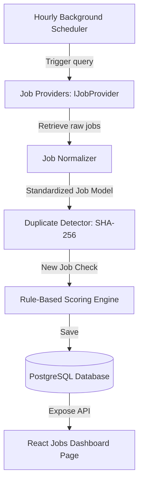

# Developer Contract — Sprint 2.1: Job Discovery Engine

This contract defines the architecture, responsibilities, and implementation constraints for the **Job Discovery Engine**.

---

## 1. Goal
Establish a self-running service that discovers developer jobs from Lever, Greenhouse, LinkedIn, and Naukri, normalizes their schemas, filters duplicates using SHA-256 hashes, calculates rule-based candidate match scores, and saves them to PostgreSQL for display in a new React Dashboard page.

**No browser automation. No logins. No OpenRouter AI tokens usage in this sprint.**

---

## 2. Structural Component Pipeline



---

## 3. Detailed Specifications

### A. IJobProvider Interface & Adapters
Every integration must implement a common asynchronous interface:
```python
class IJobProvider:
    async def search(self, query: SearchQuery) -> list[Job]:
        """Discovers new jobs for a target role query."""
        pass

    async def fetch(self, url: str) -> Job:
        """Fetches full details of a specific job posting."""
        pass
```

Implementations:
1. `GreenhouseProvider` & `LeverProvider`: Connect to their public API JSON endpoints (e.g., `https://boards-api.greenhouse.io` and `https://api.lever.co`) to retrieve real job listings without API keys or browser automation.
2. `LinkedInProvider`, `NaukriProvider`, `FounditProvider`, `WorkdayProvider`: Stub/Mock adapters that return 3-4 structured developer job postings containing target keywords (AWS, Terraform, Python) for integration verification.

### B. Standardized Database Schema
Extend the existing `jobs` database table with the following parameters:
- `portal` (source name, e.g. `Greenhouse`)
- `company` (company name)
- `title` (job title)
- `location` (posting location)
- `remote` (boolean)
- `salary` (string text description)
- `experience` (required years)
- `description` (text)
- `skills` (comma-separated or JSON list of skills)
- `apply_url` (job posting URL)
- `posted_date` (datetime)
- `scraped_date` (datetime)
- `employment_type` (e.g. `Full-time`)
- `work_mode` (e.g. `Hybrid`, `On-site`, `Remote`)
- `source_hash` (unique SHA-256 hash preventing duplicates)

### C. Duplicate Detector
- Compute hash: `SHA-256(company + title + location + apply_url)`.
- Write a query checking if the computed `source_hash` exists in the database. If it exists, discard the listing.

### D. Rule-Based Scoring Matcher
A lightweight keyword matching utility calculates candidate match score:
- **AWS** (+10)
- **Terraform** (+10)
- **Kubernetes** (+10)
- **Docker** (+5)
- **Python** (+5)
- **Linux** (+5)
- **Hyderabad** (+5)
- **Remote** (+5)
- Other keywords are computed at +0. Match score range: `0` to `100`.

### E. Hourly Background Scheduler
An asynchronous loop inside the FastAPI lifecycle (lifespan startup) executing every 3600 seconds, scanning all active job providers, running the pipeline, and emitting a `config.changed` or `jobs.updated` event over Redis.

### F. Frontend Dashboard - Jobs Page
- Expose a new route tab: **Jobs**.
- Expose search queries, filter limits (location, portal, work_mode), and sorting metrics (posted date, match score).
- Displays detailed JD content modal.

---

## 4. Verification & Testing checklist
- **Unit Tests:** Verify hash duplicate checks discard identical company/title configurations.
- **Verification queries:** Prove that database migrations apply without breaking current test cases.
